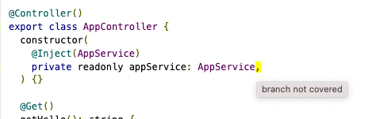

## NestJS @swc/jest test coverage

This repo reproduces a difference in test coverage between `ts-jest` and `@swc/jest`,
with a workaround for it.

## Steps to reproduce

1. Install dependencies

```
$ nvm use
$ npm install
```

2. Run tests with `ts-jest`

```
npm run test:tsjest
```

Coverage should be 100%.

3. Run tests with `@swc/jest`

```
npm run test:swc
```

Notice that Branch coverage dropped to 50%.

4. Run tests with `./create-swc-transformer.js`, a wrapper around `@swc/jest` to workaround this.

```
npm run test:swc-transformer
```

Coverage should be 100%.

## Explanation

This seems to be happening because of how `swc` transpiles the Typescript metadata for constructors.

Take this constructor:

```
constructor(
  @Inject(AppService)
  private readonly appService: AppService,
) {}
```

The `design:paramtypes` metadata for the constructor gets transpiled by `swc` to:

```
_ts_metadata("design:paramtypes", [
    typeof _appservice.AppService === "undefined" ? Object : _appservice.AppService
])
```

Notice the `typeof` ternary. This gets flagged as an "uncovered branch" by istanbul, the
coverage calculator used by jest.



Compare this to how `ts-jest` outputs this:

```
__metadata("design:paramtypes", [app_service_1.AppService])
```

No ternary, so no impact to code coverage.

`./create-swc-transformer.js` is a workaround that tells istanbul to ignore these lines that
incorrectly impact code coverage.

It inserts an '/_istanbul ignore next_/' comment in the necessary places, resulting in
transpiled code like this:

```
_ts_metadata("design:paramtypes", [
    /* istanbul ignore next */typeof _appservice.AppService === "undefined" ? Object : _appservice.AppService
])
```
